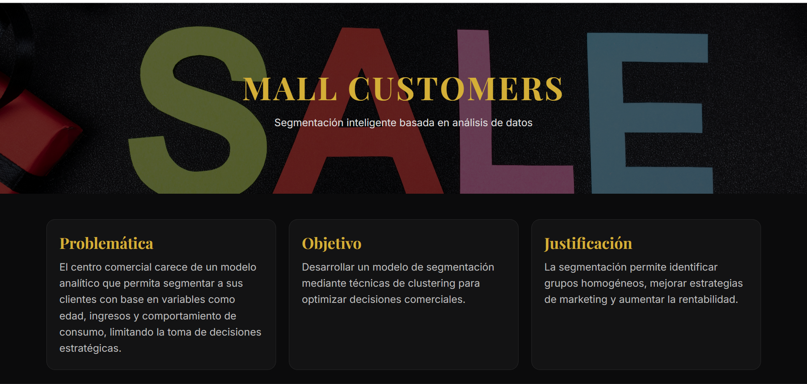
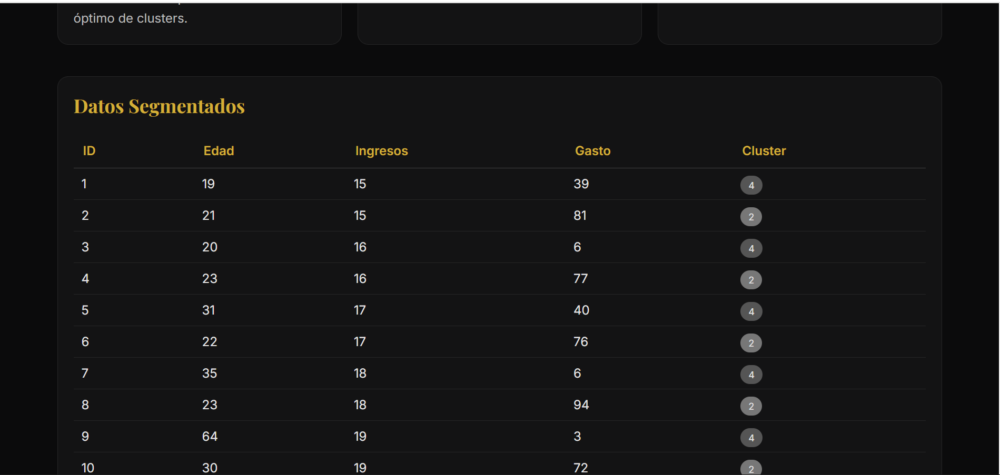

# Mall Customer Segmentation

## Overview

Machine learning project focused on customer segmentation using K-Means clustering techniques.

The objective of the project is to identify customer groups based on purchasing behavior and demographic characteristics in order to support marketing and business decision-making.

---

## Technologies Used

- Python
- Pandas
- NumPy
- Matplotlib
- Scikit-Learn

---

## Methodology

- Data cleaning
- Exploratory Data Analysis (EDA)
- Data visualization
- K-Means clustering
- Cluster interpretation

---

## Dataset Features

- Customer ID
- Gender
- Age
- Annual Income
- Spending Score

---

## Results

The model identifies customer groups with similar purchasing behaviors and spending patterns through unsupervised learning techniques.

---

## Home Page

## Segmentacion Clustering

---

## Academic Purpose

Project developed for learning and applying clustering and customer segmentation techniques using machine learning.
